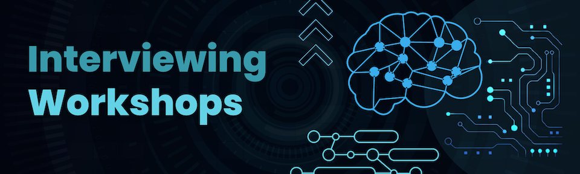
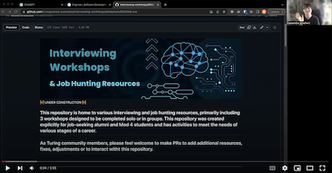

## This repository is home to 3 workshops designed to be completed solo or in groups. This repository was created explicitly for Mod 4 students and job-seeking alumni. 

## As Turing community members, please feel welcome to make PRs to add additional resources, fixes, adjustments or to interact witht this repository. 

Click the image below to see a video introduction.

   
  

   
  <picture>
    
  </picture>

- [Workshops](#workshops)
- [Usage](#usage)
- [Involvement](#involvement)
- [Justification](#value)
- [Resources](#resources)
- [Notes](#notes)

   
  

   
  <picture name="workshops">
    
  </picture>

## [Behavioral and Technical Talk Interview](./Behavioral_and_Technical_Talk_Interview_Workshop/TALK_INTERVIEW_WORKSHOP.md)

Use this workshop to improve your performance in talking interviews. 

## [Live Coding Challenge Interview](./Live_Coding_Interview_Workshop/CODING_INTERVIEW_WORKSHOP.md)

Use this workshop to improve your performance in live coding, technical interviews

## White-Boarding Challenge Interview (COMING SOON)

Use this workshop to improve your perforamnce in white-boarding, technical interviews

If you'd like to go directly to the rubrics, please find them below: 
- [Behavioral/Technical Talk Interview Rubric DOCX](Behavioral_and_Technical_Talk_Interview_Workshop/Behavioral_and_Technical_Talk_Interview_Rubric.docx)
- [Behavioral/Technical Talk Interview Rubric PDF](./Behavioral_and_Technical_Talk_Interview_Workshop/Behavioral_and_Technical_Talk_Interview_Rubric.pdf)
- [Live Coding Interview Rubric DOCX](Live_Coding_Interview_Workshop/Live_Coding_Interview_Rubric.docx)
- [Live Coding Interview Rubric PDF](Live_Coding_Interview_Workshop/Live_Coding_Interview_Rubric.pdf)
- (COMING SOON) Whiteboarding Interview Rubric

   
  

   
  <picture name="usage">
    
  </picture>

## There are 3 main workshop tools. These can be completed alone or in groups. Use these in whatever way is beneficial to you, but it is recommended to focus on utilizing the rubrics in order to identify what to change to improve. Then, practice again with those changes in mind. 

## Please find detailed instructions for each workshop here: 

- [Behavioral and Technical Talk Interview](./Behavioral_and_Technical_Talk_Interview_Workshop/TALK_INTERVIEW_WORKSHOP.md)
- Live Coding Challenge Interview (COMING SOON)
- White-Boarding Challenge Interview (COMING SOON)

## For all other resources, simply click into them to read or use them.

   
  

   
  <picture name="involvement">
    
  </picture>

### You are welcome to use this repository to interact with the content and other people.

Some ideas to get involved are:

- add notes and resources via a Pull Request. Please see Contribution Guidelines [here](./CONTRIBUTIONS.md)
- create issues to ask for help, assistance, guidance, practice buddies, and reviews on your videos. 
  - No seriously, if you want others to review your recording, please feel free to open up an issue and ask others for their feedback! 
- fork this repo to make your own notes and changes
- **star this repo so we know you found it useful and we can keep it maintained.**

   
  

   
  <picture name="value">
    
  </picture>

###  What's the value in self-assessment or peer-assessment? 

The workshop activities are centered around a rubric so that you can self-assess or you can be assessed by your peers. 

Feel free to 'Google' "self-assessment scholarly article" and "peer assessment scholarly article" to read some great research on these topics. 

Some benefits to self-assessment are:

- promotes the skills of reflective practice and self-monitoring
- develops self-directed learning
- increases motivation
- provides immediate feedback
- grows personal responsibility
- develops judgement skills
- improves feedback sills
- improves metacognition
- **improves your performance in whatever skill you are assessing**

Some benefits to peer assessment are: 

- develops feedback skills
- enhances learning through knowledge diffusion and exchange of ideas
- improves motivation
- improves complex solving problem skills
- immediate feedback
- improves metacognition
- **improves your performance in whatever skill you are assessing**

   
  

   
  <picture name="resources">
    
  </picture>

## [Google's Interview Warm Up](https://grow.google/certificates/interview-warmup/)

## [Interview Buddy](https://interviewbuddy.in/)

## [Code Interview](https://codeinterview.io/)

## [Pramp](https://www.pramp.com/#/)

## [The Golden Rubric for Technical Interviews](https://medium.com/swlh/the-golden-rubric-for-technical-interviews-2f087ef2ba1)

## [Google Coding Interview Rubric - An Inside Look](https://www.tryexponent.com/blog/google-coding-interview-rubric)

## [4 Tips to Nail a Virtual Job Interview](https://hbr.org/2021/03/4-tips-to-nail-a-virtual-job-interview)

   
  

   
  <picture name="notes">
    
  </picture>

### Feedback is difficult

- 'Google' "how to give helpful constructive feedback" or "how to give good feedback to peers" to learn how to give great feedback.
- 'Google' "how to take feedback" to learn how to take feedback. 
- Read a book about feedback: Nonviolent Communication, Radical Candor, Thanks for the Feedback.
- Generally, feedback should be kind, actionable, and constructive. This doesn't mean you need to sugar-coat your feedback, it just means you need to use your communication skills to get your point accross in a way that will allow the receiver to utilize the feedback successfully. 
- Consider researching 'Growth Mindset'

### Assessing is the most important part of the workshops activities

- Practicing a skill can be futile if you're practicing in the wrong way or practicing the wrong thing. By observing and objectively making judgements about the performance, you can use the feedback generated from that observation to improve. 
- To learn more about skill building, consider reading: Practice Perfect: 42 Rules for Getting Better at Getting Better

### Why is this a GitHub repository and not an article? 

- You can contribute and interact.
  - Contributions look good on your GitHub profile. Your GitHub profile is a factor in your job hunt!
  - Your contributions can help this repo improve and be more helpful to others who are hunting for work. 
  - If you want feedback on something, open an issue!
- I know that each developer at Turing has a GitHub account and is familiar with using GitHub. That is not the case for other tools. 
- One day, we may have built-in code challenges. They'd need a repo anyways, so this prevents us from needing multiple tools. 